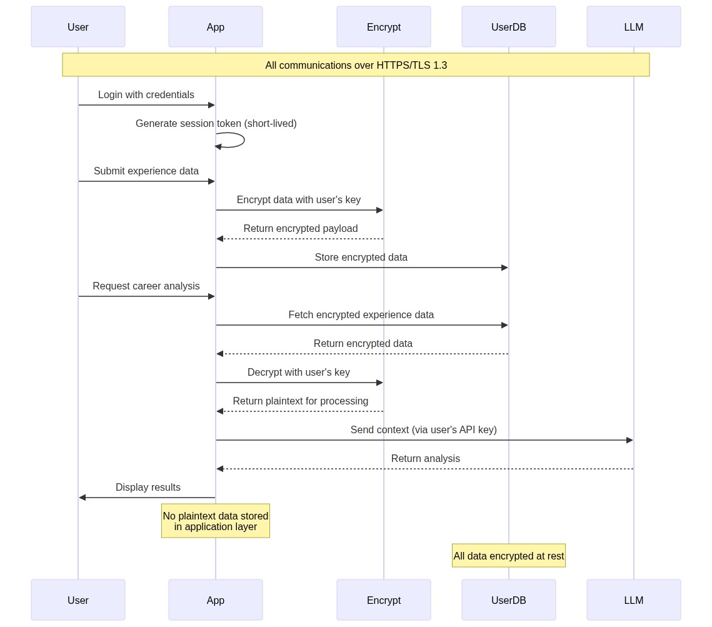

# Security Architecture

## Privacy-First Design Principles

### Core Security Philosophy
- **Zero-Trust Architecture**: No component trusts any other by default
- **User Data Sovereignty**: Users maintain full control over their data location and access
- **Encryption Everywhere**: All data encrypted at rest, in transit, and in processing where possible
- **Minimal Data Collection**: Only collect what's absolutely necessary for functionality
- **Transparent Security**: Users can audit and understand all security measures

## Security Architecture Overview

[](../../assets/diagrams/security-architecture-overview.mmd)

## Data Flow Security

[](../../assets/diagrams/data-flow-security.mmd)

## Security Guarantees to Users

### 🔒 Data Sovereignty
- **Your Database, Your Control**: Data stored in your chosen cloud provider account
- **Your Keys, Your Access**: We never store your database credentials or API keys
- **Delete Anytime**: Complete data deletion under your control
- **Geographic Control**: Choose your data residency location

### 🛡️ Encryption Standards
- **AES-256 Encryption**: Military-grade encryption for all stored data
- **TLS 1.3**: Latest transport layer security for all communications
- **Key Rotation**: Automatic encryption key rotation every 90 days
- **Perfect Forward Secrecy**: Each session uses unique encryption keys

### 🔍 Transparency Measures
- **Open Source Security**: Security modules available for audit
- **Security Audit Logs**: Complete audit trail of all data access
- **Privacy Dashboard**: Real-time view of your data and access patterns
- **Incident Reporting**: Immediate notification of any security events

### 🚫 What We DON'T Do
- **No Data Mining**: We never analyze your data for business purposes
- **No Third-Party Sharing**: Your data is never shared with advertisers or partners
- **No Permanent Storage**: Application servers are stateless and ephemeral
- **No Backdoors**: No administrative access to your encrypted data

## User Authentication & Authorization

### Multi-Factor Authentication (MFA)
```yaml
Primary: Password (PBKDF2 with 100,000+ iterations)
Secondary: 
  - TOTP (Time-based One-Time Password)
  - WebAuthn/FIDO2 hardware keys
  - SMS (backup only, not recommended)
```

### Session Management
- **Short-lived tokens**: 15-minute session tokens
- **Refresh token rotation**: New refresh token with each use
- **Device binding**: Sessions tied to specific device fingerprints
- **Concurrent session limits**: Maximum 3 active sessions per user

### Role-Based Access Control (RBAC)
```yaml
Roles:
  - Owner: Full access to all data and settings
  - Viewer: Read-only access to experiences and summaries
  - Editor: Can modify experiences but not system settings
  - Auditor: Access to audit logs and security settings only
```

## Threat Model & Mitigations

### Identified Threats

| Threat | Impact | Mitigation |
|--------|---------|------------|
| Data breach at cloud provider | High | User-controlled encryption keys, provider-agnostic design |
| Man-in-the-middle attacks | High | Certificate pinning, HSTS, TLS 1.3 |
| Application server compromise | Medium | Stateless design, no persistent data storage |
| API key theft | Medium | Key rotation, usage monitoring, anomaly detection |
| Insider threat | Low | Zero-knowledge architecture, audit logging |
| Social engineering | Medium | MFA enforcement, security awareness training |

### Defense in Depth Strategy

1. **Network Security**
   - WAF (Web Application Firewall)
   - DDoS protection via Cloudflare
   - Rate limiting and IP reputation

2. **Application Security**
   - Input validation and sanitization
   - SQL injection prevention (parameterized queries)
   - XSS protection (Content Security Policy)
   - CSRF protection (SameSite cookies)

3. **Data Security**
   - Encryption at rest (user-controlled keys)
   - Encryption in transit (TLS 1.3)
   - Encryption in memory (where possible)
   - Secure key management (HSM/KMS)

4. **Operational Security**
   - Security incident response plan
   - Regular security assessments
   - Vulnerability management program
   - Employee security training

## Compliance & Standards

### Regulatory Compliance
- **GDPR**: Full compliance with EU data protection regulations
- **CCPA**: California Consumer Privacy Act compliance
- **SOC 2 Type II**: Annual security audits and certifications
- **ISO 27001**: Information security management standards

### Industry Standards
- **NIST Cybersecurity Framework**: Risk management approach
- **OWASP Top 10**: Web application security best practices
- **CIS Controls**: Cyber security benchmarks
- **Zero Trust Architecture**: NIST SP 800-207 guidelines

## Security Monitoring & Incident Response

### 24/7 Security Monitoring
- **SIEM Integration**: Security Information and Event Management
- **Anomaly Detection**: AI-powered unusual activity detection
- **Threat Intelligence**: Real-time threat feed integration
- **Automated Response**: Immediate threat containment

### Incident Response Plan
1. **Detection**: Automated alerts and manual reporting
2. **Analysis**: Threat assessment and impact evaluation
3. **Containment**: Immediate threat isolation
4. **Eradication**: Root cause elimination
5. **Recovery**: Service restoration and monitoring
6. **Lessons Learned**: Post-incident review and improvement